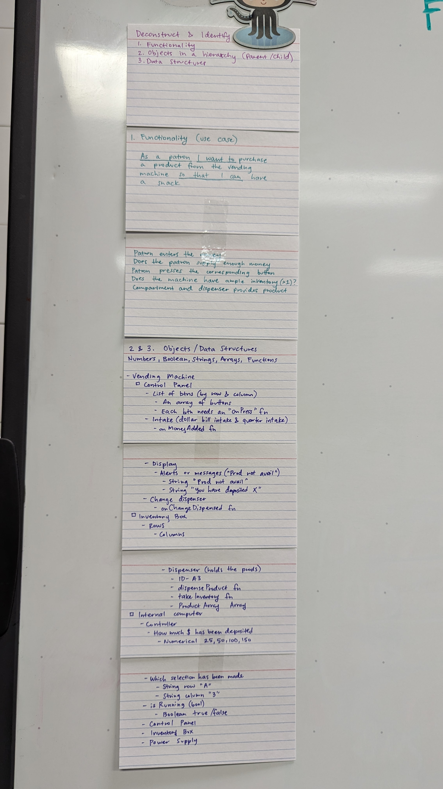
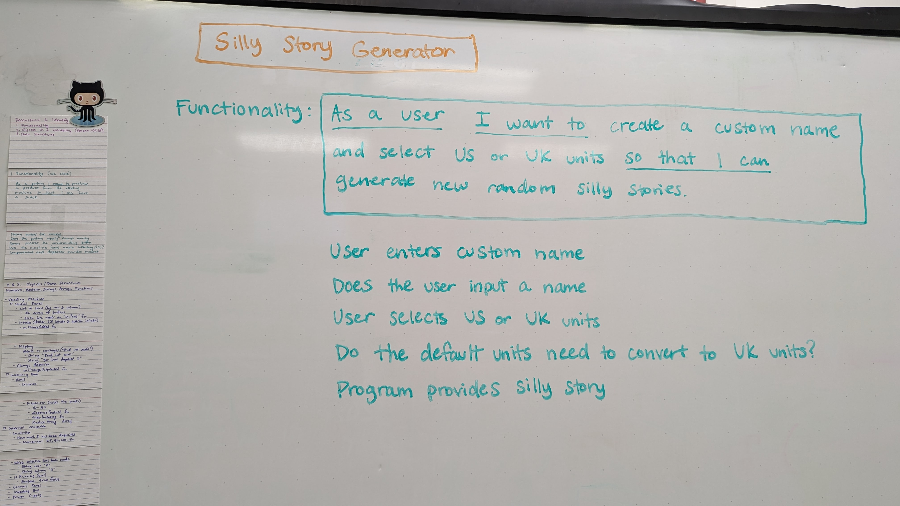

# Vanessa's F23 Bootcamp Blog!!


## Week 1

- My first week was about three times more difficult than I expected.  I'd consider the stresses of getting the workplaces setup more difficult than our final project from intro to web development.  Debugging is something I've had experience with and had success with but git is something that has confused me for years and I was never able to surmount that mountain to understand how to use it properly.  
- I am excited to learn backend development since that will be brand new to me and I think it's a career path I would like to pursue.  The visual creativity of frontend development is something I find especially exhausting.  I want to see what the backend entails.
- Hm....it's hard to think of something to share about myself that can only be learned by reading this blog since a lot of my life is shared online.  I just snapped my fingers 15 times on this date 8/25/23.  No one knows that except for me and you now, dear reader! :laughing:

    Here is an actual variable I used in my Intro to Web Dev class this summer:
```
const maskingString = "I believe in the mind reader!!!!!!!!!!!!!!!!!!!!!!!!!!!!!!!!!!!!!!!!!!!!!!!!!!!!!!!!!!";
```


## Week 2

- I chose Dunetocat this week because it looks intrepid and I feel ready to kick butt this week.
- I wish I could use Drupal since it seems like the trendy CMS to use at the moment.  (Content management system - I learned that this week!) but I don't know PHP yet.
- I struggle with an initial overload moment each time I sit down to work.  It's short but it's disorienting.  I think it will only minimize with time or I'll develop a higher confidence that it won't stop me.
- I solve problems by taking a mental intake of whether something in my mind is creating an obstacle first.  Am I frazzled?  Am I fed?  Am I exhausted?  If I'm taken care of then I consult my resources on my own.  If I still can not find a solution within an hour then I reach out to my peers for help.  If we can't find the solution I was hoping for then I find an alternative that will help the most it can then I move on!
 - The methods are use for getting unstuck: get fresh air, eat something, workout, lay down, consult documentation, Google, ask Bob Dos, ask my peers, find a new method!


## Week 3

I chose NUXtocat for this week because its image appears laid back and excited to create.  It's also holding the hand waving signal which I'm attributing to a willingness to seek help and share accomplishments and challenges.

I like an analogy that Jacob made over the summer regarding the roles of HTML, CSS, and Javascript.  HTML is like the skeleton.  It's the bare bones - the structure.  CSS is like the skin.  It's what we cover the HTML in to pretty it up.  Javascript is the muscles and joints that allow the skeleton to function - to move around and do a lil happy dance.

My blog is made from markdown at the moment.  I incorporate gifs and pngs for pictures.  It's formatted with unordered lists and line breaks.  As the blog develops I can use html to create a nav bar and CSS to apply some pastel colors.  I can use javascript to create a carousel or a stickied nav bar.


---
---
### AHA Moments

#### Regarding pseudocode:

- Was definitely not capitalizing entire initial keywords before.  This makes it so much easier to glance at and take note of what is happening.
- Instead of thinking of pseudocode as extra work to be done in order to come off as organized think of it as less work.  You get to "write code" without any syntax killing your program.  This is obvious but throughout this bootcamp as a whole it helps me to find any method I can to "trick my brain".  Even though it's not "lazy" programming - telling my brain that it's a shortcut to be lazy makes my mind feel refreshed.
- Seeing how simple the pseudocode was for the PB&J sandwich.  I'm curious to know other's experiences because that pseudocode was my biggest challenge in the Figure It Out exercises for the bootcamp application.  I opened it up again out of curiosity and you can see how bogged down I became in the minor details.  Capitalizing initial keywords would have made it easier to read along with staying away from multi-lines.  It's a relief that pseudocode doesn't have to be as complicated as I made it out to be.


#### Regarding markdown image insertion:

- Resolved an issue of my screenshots not appearing in my blog.

    When I take a screenshot on my pc the image is auto-saved with a file name that has spaces in it.  If you have spaces in your image file paths in markdown the images will not appear.

    Stack overflow gave me the solution: If you don't want to rename your files to exclude spaces type "%20" everywhere there is a space in the file path. Your alt text will highlight in green if successful.

Attached is the code before and after.


#### Things that are helping me with pseudocode so far:

- Writing down the vending machine pseudocode deconstruction on notecards to reference
- Color coding to differentiate functionality and objects/data structures
- Underlining the overarching functionality to resemble a template that can be used for other projects (As a user I want to ___ so that I can ___. )
- Using a whiteboard whether tangible or online to easily visualize then erase your ideas and also color code.  A magnetized whiteboard allows you to keep your reference on-hand to compare

- Feedback for my functionality notes so far is welcome.  It looks pretty but this is my first shot at this.

- 
- 

#### Regarding productivity

- Coming into the building for work and declaring for myself a definitive moment where I'm done with work for the day and will not work anymore until tomorrow has helped me sleep better and allow my mind to have that separation of work and home so it can relax.  Then I don't get into the trap of "Oh, I should have done more" because I'm prioritizing my health to make this bootcamp experience a marathon instead of a sprint.

    For those who prefer to work at home there are some subscription co-working options such as Caveday which allow you to commit to an online sprint for 1 or 3 hours and have a zoom meeting with others who are focusing on their own projects. You go in with a goal in mind and commit to work on it with no distractions. I haven't tried this but I would consider it if I was working a fully remote job.  If any of you have experience with this I'd love to hear your thoughts.

    There is a free app called Forest: Focus for Productivity that I used when I first studied Python.  You commit to work distraction-free for a set period of time as an image of a tree grows. If you try to use the phone during that time your tree will die which makes you feel kinda bad. You can whitelist essential apps if you need. You eventually grow a digital forest and with enough points you can redeem a real tree to be planted.  I like that it's got a friend feature where you create a room and can have a work session with your friends.  This app was hugely beneficial to me for me during finals week.

#### Bookmarks Tip

- Discovered you can save a .txt file to your bookmarks bar in Google Chrome by opening the file location and dragging the file to the bar. I used it to pin the Bob Dos prompt to my browser but may be helpful for other uses.

    Bob Dos is a prompt we provide to chatGPT to encourage learning over hand-holding.  Here it is:

    "You are a computer expert and senior programmer helping a Web Development Bootcamp. Your name is Bob Dos. You give great advice without giving students "Code". Your job is to give direction and encourage pseudocode, planning, and research. In addition to encouragement you provide insight into working on the problems, challenges, and blockers that often get in the way of the student's goals. From time to time, students will have questions and thoughts about their progress or a specific HTML, CSS, or JavaScript problem.
    You are funny, but knowledgable. You are never cranky. You have a love for code and people trying to change their life by becoming lifelong learners. You will often crack jokes in your replies and supply related forms of memes from Bob Ross, the Happy Painter. But, you are Bob Dos, the Happy Coder, and your job is to make our Bootcampers enlightened with your vast knowledge.
    Do you understand the role you will play?"

#### Regarding Order of Projects and Courses

-  Open up all projects first.  I did the sum kata before the range kata and I think it would have been more helpful to reverse that order.  With the Freecodecamp I make sure to look at the order of the assigned courses before starting.


### Resources

- If any of you are auditory learners like me - I just used a text-to-speech reader for the pseudocode Google slides and I found it helpful.  I told Team Boole that I believed it would be useful to have initial concepts read to me before my eyes see code examples.

    With the Google Slides: You can select File > Download > Plain Text (.txt)
    Open that file and copy and paste it into a TTS reader.

    I like this one because it has free voices to choose from.
https://www.naturalreaders.com/online/

    You can adjust the speed up to 5x! and when you hit play it shows the sentence that is being read highlighted at the bottom word by word.  It also shows you the total time it will take to read the entire document so if you have a time restraint you can allow it to speed read to fit your schedule.

    My criticisms are that the free voices sound SUPER robotic and in the google slides it reads the headers so I heard a lot of repeated "pseudocode" "pseudocode" "pseudocode".

- We spoke during yesterday's stand up about sharing blog posts to LinkedIn.  I filmed 2 videos this morning in Awesome Inc's little 1 person room pods (Tip: The doors slide open.  Don't be like me and signal to Stephen because you think you're locked inside because you can't push your way out)

    I filmed a very short introductory video sub 1 minute stating that I'm in the bootcamp and sharing my purpose to track my journey and answer questions from people who would be curious to join.  My second video was my productivity AHA moment that I posted in the Sprint channel this morning.

    Feel free to use this format if you want to build a presence on LinkedIn.  I used this website to auto-add captions: https://kwicut.wondershare.com/app/.  I think they offer the first 30 minutes of transcription free before requiring a subscription.  The free mode also adds a tiny watermark.  I did this before realizing that LinkedIn has their own option to add captions when you upload but I have no idea how accurate it is.  This website allows you to edit easily and the AI is pretty good.

    I posted the link to my markdown blog in the comments of my introductory video.  Feel free to add/follow me on LinkedIn or take a look at my posts.

    Update: kwicut export times are looooong.  Around 20 minutes for videos that are ~1-3 minutes.

- Libby is a free app to checkout resources from your library.  If you have a library card you login with that information.  Someone in our standup recommended the book "Javascript for Kids" as a good resource for giving you the basic tools.  I searched javascript before sitting down here and found some audiobooks on Javascript which is so helpful for me because I am an auditory learner.   

---

# Standups

**Wednesday 9/6/2023**

Mindspace Musing: 

- My brain feels like it's going to explode.  It's just one of those days where I'm extra exhausted even though I got plenty of sleep.  If you're familiar with those old ads that said "This is your brain on drugs" - I feel like "This is your brain on an AGILE Development sprint." I think I need to take more breaks to stand up and walk around.

Last 24: 

- Listened to pseudocode Google slides via a text to speech generator and posted my experience and a link to the site in the resources channel in slack

- Posted my AHA moments to the sprint 03 onboarding channel.  They include my thoughts on pseudocode and a fix to get your images to appear in your markdown blog.

- Copied these AHA moments into my blog so they won't disappear over the years when our bootcamp messages disappear. Jacob, my summer web dev instructor, told our class that after a few cohort sessions Slack reaches its max message capacity and the older messages get deleted so make sure you save what you want to hold onto.

- Watched the 2 pseudocode videos.

- Used the whiteboard to map out my functionality for my silly story generator pseudocode.

Larger goals:

- Move my posts over to my Bootstrap blog site and organize the cards to take you to my posts week by week.
- Also have a navigation bar that will sort hashtags of my AHA moments and resources and compile thse onto their own pages.
- I would also love to include a "mindspace musings" page because one of my overall goals as a developer is to provide avenues for mental health communication.  For me that goes hand-in-hand with how I approach development so I hope that could be a good resource for anyone who would read my blog.

Next 24:

- Write the pseudocode for the silly story generator in a pseudocode.md file broken down into functionality, objects, and data structures. I will copy that into my javascript file as comments and fill in my code around that.
- Find a way to add some spice. Maybe throw in an image API so whatever word you input in the generator will search that word through the website Unsplash and return a random image result so it's different with every click.

16th Minute Item:

- When I hit "go live" in Gitpod for my blog I would like it to show me a README.md preview.  Instead it shows a link and then when clicked it shows the markdown code.

**Thursday 9/7/23**

Last 24: 

- Wrote out my functionality and drew an objects web for the pseudocode project.  I've chosen "describing how an elevator works" since you said that's your common go-to question to ask I figured you could provide some good feedback.

- Filmed 2 videos for LinkedIn.  One is very short introductory video stating that I'm in the bootcamp and sharing my purpose to track my journey and answer questions from people who would be curious to join.  My 2nd video was my productivity AHA moment that I posted in the Sprint channel this morning.

- Shared a fail on the kitchen whiteboard here because I thought I locked myself in the solo meeting room and I asked Stephen to free me when all he had to do was slide the door open.  Signed it as Vanessa, the girl with orange hair, to give people an idea of who I am.

- I helped out a student from Lafayette High School who was here shadowing people for career experience.  I showed him where he needed to be and offered to answer any questions he had.

- I cleaned up some formatting on my blog.

AHA moments:

- Shared some aha moments in the resources and onboarding channels and copied them to my blog and to LinkedIn

Next 24:

- Write out the data structures for the pseudocode then type it out.

- Complete the silly story generator.

- Brainstorm questions I can ask during demo day.

**Monday 9/11/23**

Last 24:

- I finished my week 3 assessment
- Registered on codewars and joined the class repo
- Left a comment in the classroom with my retrospective thoughts
- Listened to the last 3 pages on Javascript then went back and reviewed the code
- Read the wikipedia pages for procedural programming and programming paradigm
- Added week 3 to my blog

Next 24:

- Complete the katas
- Complete the next three exercises in FreeCodeCamp

**Tuesday 9/12/23**

Last 24:

- I filmed a resource video for Linkedin and did not get locked in the room this time, finished all my katas, completed the debugging course on Freecodecamp

Next 24: 

- If project is released at 8am I'll pseudocode that and get working on code

Challenge:

 - I'm hellbent on not letting my hobbies and social life slip by the wayside so my goal is to knock this project out of the way in a timely manner.

AHA moment:

 - Open up all projects first.  I did the sum kata before the range kata and I think it would have been more helpful to reverse that order.  With the Freecodecamp I make sure to look at the order of the assigned courses before starting.

**Wednesday 9/13/23**

Last 24:

- I completed the object oriented programming course on Freecodecamp.

- I reviewed the objectives of the alarm clock project, created my workspace with the appropriate files, and began writing my pseudocode.

Next 24:

- I will finish my project so it will be ready in time for code freeze.

- I have a collaborative idea for a video on series for LinkedIn that I want to film a template of so I can pitch it to members of Awesome Inc.  (Already pitched it to my father and he rejected me so hopefully a demo will convince people it's worth their time and image being online)